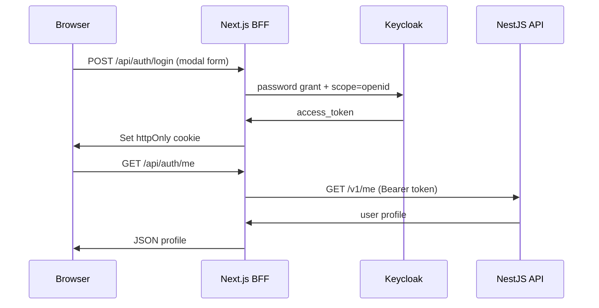

# Platform Web (MVP)

Next.js client with **in-app login modal** (no redirect to Keycloak).  
Auth flow uses Vercel Route Handlers (BFF) + httpOnly cookie.

## Local development

```bash
cd apps/web
cp .env.example .env.local
npm install
npm run dev
```

Open http://localhost:3000 — guest content is visible; **Sign in** opens a modal.

## Environment variables

| Variable | Example |
|----------|---------|
| `NEXT_PUBLIC_KEYCLOAK_URL` | `https://iabuilding.duckdns.org/auth` |
| `NEXT_PUBLIC_KEYCLOAK_REALM` | `construction-marketplace` |
| `NEXT_PUBLIC_KEYCLOAK_CLIENT_ID` | `platform-web` |
| `NEXT_PUBLIC_API_URL` | `https://iabuilding.duckdns.org/api` |

Set the same values on Vercel (Production + Preview).

## Keycloak setup

Realm: `construction-marketplace`  
Client: `platform-web`

Required for modal login (password grant via BFF):

1. **Direct access grants**: **ON** (trial/MVP only)
2. **Standard flow**: can stay ON for future SSO
3. **Client authentication**: Off (public client)

Existing realm on EC2: update manually in Admin Console if already imported.

## Auth flow



## Deploy to Vercel

See [docs/deployment-vercel.md](../../docs/deployment-vercel.md).

**Note:** Redirect URIs for `platform-web` are no longer required for modal login, but keep localhost/Vercel origins if you add OIDC redirect later.

## Security note

Password grant via BFF is acceptable for MVP. For production, prefer a confidential server client with secret stored only on Vercel, or return to Authorization Code + PKCE when redirect UX is acceptable.
