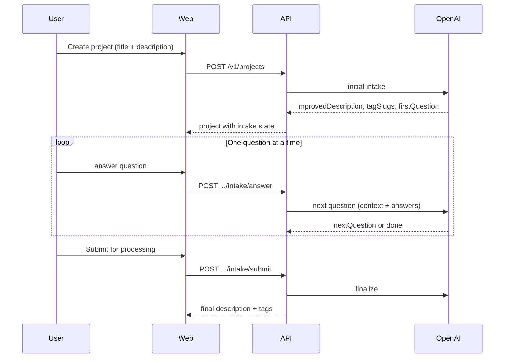

# AI intake (OpenAI)

Initial OpenAI integration for project scope intake: improved description, AI tags, and a one-question-at-a-time follow-up wizard.

## Flow



## Why one question at a time?

Answers can change what should be asked next (e.g. renovation scope → ask about area; new build → ask about land). A single static form cannot adapt. One question per step also keeps the UX focused.

## Configuration

| Variable | Required | Default |
|----------|----------|---------|
| `OPENAI_API_KEY` | no* | — |
| `OPENAI_MODEL` | no | `gpt-4o-mini` |

\* Without API key, a **rule-based fallback** runs (keyword tags + fixed question queue).

Set in `infra/.env` on EC2:

```env
OPENAI_API_KEY=sk-...
OPENAI_MODEL=gpt-4o-mini
```

Restart API after change.

## Question types

| Type | UI | Example |
|------|-----|---------|
| `single` | Radio | Property size band |
| `multi` | Checkbox | Trades involved |
| `text` | Textarea | Material notes |
| `info` | Continue button | Upload floor plans |

State is stored in `brief_json.ai.intake`.

## API

| Method | Path | Description |
|--------|------|-------------|
| POST | `/v1/projects` | Create + run initial AI intake |
| POST | `/v1/projects/:id/intake/answer` | Submit answer, get next question |
| POST | `/v1/projects/:id/intake/submit` | Finalize description and tags |

## UI

- **Create project:** no tag picker — tags assigned by AI on detail page
- **Project detail:** intake wizard until completed; tags shown in wizard then on page
