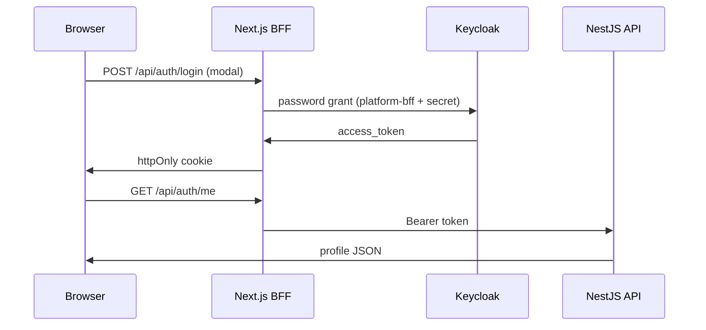

# Authentication — Keycloak (MVP)

The MVP uses **self-hosted Keycloak** on EC2. The NestJS API validates JWT access tokens issued by Keycloak; it does not implement password login itself.

---

## 1. Flow Overview



---

## 2. Realm and Clients

| Client | Type | Direct access | Purpose |
|--------|------|---------------|---------|
| `platform-bff` | Confidential | ON | Vercel server login only |
| `platform-web` | Public | OFF | Future OIDC / PKCE |
| `platform-api` | Public | OFF | JWT audience reference |

See [auth-bff-client.md](./auth-bff-client.md) for setup.

---

## 3. Roles

Realm roles (in JWT `realm_access.roles`):

- `client` — project owner
- `contractor` — bid/tender participant
- `designer` — design tender path
- `admin` — platform admin
- `support` — support agent

NestJS guards check roles after JWT validation. Business permissions (e.g. own project only) are enforced in application services.

---

## 4. Local User Sync

Keycloak holds authentication; PostgreSQL holds profile and business data.

On first authenticated request:
1. Validate JWT.
2. Upsert `users` by `keycloak_sub` (claim `sub`).
3. Copy email, name from token claims.

Optional: Keycloak **Event Listener** or webhook for registration → create org stub.

---

## 5. NestJS Integration (Target)

```typescript
// Guard validates JWT via JWKS
@UseGuards(JwtAuthGuard, RolesGuard)
@Roles('contractor')
@Post('tenders/:id/bids')
submitBid() { ... }
```

Libraries:
- `passport-jwt` + `jwks-rsa`, or
- `@nestjs/passport` with custom strategy fetching JWKS from:

```
${KEYCLOAK_ISSUER}/protocol/openid-connect/certs
```

Validation checks:
- Signature (RS256)
- `iss` === `KEYCLOAK_ISSUER`
- `exp` not expired
- Optional: `aud` or `azp` for client binding

---

## 6. Environment Variables

| Variable | Example |
|----------|---------|
| `KEYCLOAK_ISSUER` | `http://EC2_IP/auth/realms/construction-marketplace` |
| `KEYCLOAK_JWKS_URI` | `.../protocol/openid-connect/certs` |
| `KEYCLOAK_REALM` | `construction-marketplace` |

Internal container fetch (optional):
`http://keycloak:8080/auth/realms/construction-marketplace/...`

Public issuer in tokens must match what browsers use.

---

## 7. Keycloak Behind Caddy

| Setting | Value |
|---------|-------|
| `KC_HTTP_RELATIVE_PATH` | `/auth` |
| `KC_PROXY_HEADERS` | `xforwarded` |
| `KC_HOSTNAME` | public host (IP or domain) |

Caddy proxies `/auth*` to Keycloak **without** stripping the prefix.

---

## 8. What to Defer Post-MVP

- Social login (Google, Apple)
- MFA / TOTP (enable in realm when needed)
- Organizations mapper (Keycloak groups → org_id claim)
- Central admin SSO

---

## 9. Switching to Auth0/Clerk Later

Keep `users.keycloak_sub` or rename to `external_id`. Migration:
1. Export users from Keycloak.
2. Import to new IdP or use federated link.
3. Update `KEYCLOAK_ISSUER` / JWKS URL in API.
4. Update web OIDC client config.

Application authorization logic stays unchanged if JWT shape (sub, email, roles) is preserved.
