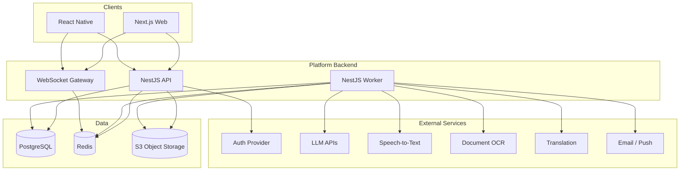

# Backend Architecture — MVP

This document defines the target backend architecture for the Construction Marketplace Platform MVP. It is intended as the primary reference for implementation planning, module boundaries, and future service extraction.

**Related documents:**
- [Product Definition Document (PDD)](../PDD.md)
- [Deployment — MVP](./deployment-mvp.md)
- [Domain State Machines](./domain-state-machines.md)

---

## 1. Goals and Constraints

### Goals
- Ship MVP quickly with a single deployable backend.
- Support core workflows: AI project intake, estimation, tendering, contracts, messaging, reviews, support.
- Keep clear module boundaries for later microservice extraction.
- Maintain auditability for tenders, bids, and contracts.

### Constraints (MVP)
- One primary market/region at launch (configurable via `region_code`).
- Modular monolith (not microservices).
- English as primary language; translation via async jobs.
- No payments/escrow in MVP. Platform fees are **disclosed in the UI** (contractor-paid access fee + success fee) with a temporary **100% trial discount** (amount due = 0). Clients use the core platform for free until premium services are enabled. Actual charge collection is deferred until a billing legal entity and payment provider are in place.

---

## 2. Architecture Style

**Pattern:** Modular monolith (NestJS) + asynchronous workers + PostgreSQL as system of record.

| Layer | Responsibility |
|-------|----------------|
| API (HTTP + WebSocket) | Auth, REST, realtime gateway |
| Application services | Use cases, orchestration, authorization |
| Domain | Entities, state machines, invariants |
| Infrastructure | DB, cache, queue, S3, external AI APIs |
| Workers | BullMQ consumers (AI, estimation, tender, notifications) |

**Cross-cutting:** structured logging, OpenTelemetry traces, `audit_events`, idempotency keys on critical writes.

---

## 3. System Context



---

## 4. Modules (Bounded Contexts)

Each module owns its tables and exposes use cases via application services. Cross-module access goes through facades or domain events — not direct repository imports across modules.

| Module | Responsibility |
|--------|----------------|
| `identity` | Users, organizations, roles, contractor profiles, verification status |
| `projects` | Project lifecycle, structured brief (`brief_json`), readiness score |
| `media` | Presigned uploads, attachment metadata, file linking |
| `ai-orchestration` | Intake sessions, prompts, LLM routing, JSON validation, async AI jobs |
| `estimation` | Work breakdown, regional price catalog, estimate versions |
| `tendering` | Invitations, Q&A, bids, comparison, tender state machine |
| `contracts` | Template registry, draft generation, contract status |
| `messaging` | Project threads, realtime delivery |
| `progress` | Milestone updates, photos, activity timeline |
| `reviews` | Post-project ratings, basic moderation |
| `support` | Platform usage tickets (no construction advice) |
| `notifications` | Email/push/in-app, templates, delivery idempotency |
| `localization` | Translation jobs and cached translations |
| `admin` | Verification, catalog, templates (thin MVP surface) |

### Module dependency rules
- `ai-orchestration` may read/update `projects` only through `ProjectsFacade`.
- `tendering` depends on `projects` + `identity` (contractor pool).
- `contracts` depends on `tendering` (winning bid) + `projects`.
- `notifications` subscribes to domain events from all modules (outbox pattern).

---

## 5. Application Layer Pattern

```
HTTP/WS Controller
  → DTO validation (class-validator / Zod)
  → Application Service (use case)
  → Domain entity + state machine
  → Repository (Prisma)
  → Domain event → Outbox table → Worker
```

**Rules:**
- No LLM calls from controllers.
- All AI outputs validated against JSON Schema before persistence.
- Authorization enforced in application services (defense in depth with guards).

---

## 6. Core Data Model (MVP)

### Identity
- `users` — platform user linked to IdP `sub`
- `organizations` — client company or contractor company
- `organization_members` — role within org
- `contractor_profiles` — trades, regions, verification_status

### Projects
- `projects` — status, client_id, region_code, `brief_json`, readiness_score
- `project_attachments` — media_id, type (photo, blueprint, spec, …)

### AI
- `ai_sessions` — project_id, channel (text/voice)
- `ai_messages` — role, content, token/cost metadata

### Estimation
- `price_catalog_items` — region, category, unit, rate, currency
- `estimates` — project_id, version, totals_json, confidence, disclaimer

### Tendering
- `tenders` — project_id, status, schedule
- `tender_invitations` — contractor_org_id, status
- `tender_questions` / `tender_answers`
- `bids` — price, duration_days, conditions_json

### Contracts
- `contract_templates` — jurisdiction, version, body template
- `contracts` — project_id, bid_id, document_url, status

### Collaboration
- `messages` — thread_id, sender, body, attachments
- `progress_updates` — project_id, milestone, body, media refs
- `reviews` — target org, rating, comment, project_id

### Platform
- `support_tickets`
- `notifications`
- `audit_events` — actor, action, entity, payload
- `outbox_events` — for reliable async processing

Structured payloads (`brief_json`, `conditions_json`, estimate lines) must conform to versioned schemas in `packages/contracts-schemas`.

---

## 7. API Design (MVP)

### REST (`/v1`)
| Area | Examples |
|------|----------|
| Projects | `POST /projects`, `GET /projects/:id`, `PATCH /projects/:id/brief` |
| AI | `POST /projects/:id/ai/sessions`, `POST /ai/sessions/:id/messages` |
| Estimates | `POST /projects/:id/estimates/generate`, `GET /estimates/:id` |
| Tenders | `POST /projects/:id/tender`, `GET /tenders/:id/bids` |
| Bids | `POST /tenders/:id/bids` (contractor), idempotent |
| Contracts | `POST /projects/:id/contract/generate`, `POST /contracts/:id/accept` |
| Messages | `GET /projects/:id/messages`, `POST /projects/:id/messages` |

### WebSocket
- Channels: `project:{id}`, `tender:{id}`
- Events: `message.created`, `bid.submitted`, `tender.status_changed`, `progress.updated`

### Idempotency
Required on: bid submission, contractor selection, contract acceptance, tender publish.

Header: `Idempotency-Key: <uuid>`

---

## 8. Background Jobs (BullMQ)

| Queue | Jobs |
|-------|------|
| `ai` | Intake step, document parse, brief normalization |
| `estimation` | Generate/recalculate estimate |
| `tender` | Send invitations, reminders, auto-close tender |
| `contracts` | Render PDF/HTML, upload to S3 |
| `notifications` | Email, push, in-app |
| `translation` | Batch translate user content |

Workers run as a **separate process** from the HTTP API (same codebase, different entrypoint).

---

## 9. AI Integration

### Components
- `AiProviderRouter` — primary + fallback LLM provider
- `IntakeAgent` — dialog, requests missing fields/attachments
- `BriefNormalizer` — unstructured → `brief_json`
- `EstimateAssistant` — suggests WBS lines (validated by rules engine)
- `RagService` — pgvector for FAQ, templates, pricing notes (optional in early MVP)

### Guardrails
- PII redaction before external API calls
- Per-project token/cost budgets
- JSON Schema validation on all structured outputs
- Human review flag for low-confidence estimates and contract sections

---

## 10. Security (MVP Baseline)

- Authentication via **Keycloak** (self-hosted on EC2 for MVP; JWT validation in API). See [auth-keycloak.md](./auth-keycloak.md)
- RBAC: `client`, `contractor`, `designer`, `admin`, `support`
- Row-level authorization: users access only projects they own or are invited to
- Presigned S3 URLs with short TTL
- `audit_events` for tender, bid, contract, and admin actions
- Rate limiting on AI and auth endpoints (Redis)

---

## 11. Observability

- Structured JSON logs (request_id, user_id, project_id)
- OpenTelemetry traces: HTTP → DB → queue → external AI
- Metrics: queue depth, AI latency/cost, tender conversion, error rates
- Product analytics via PostHog (frontend + key backend events)

---

## 12. Repository Layout (Target)

```
apps/
  api/              # NestJS HTTP + WebSocket
  worker/           # BullMQ consumers
packages/
  contracts-schemas/  # JSON schemas: brief, bid, estimate
  domain/             # Shared enums, state machine types (optional)
docs/
  backend-architecture-mvp.md
  deployment-mvp.md
  domain-state-machines.md
infra/
  docker-compose.yml  # local: api, worker, postgres, redis, minio
  terraform/          # AWS (staging/prod)
```

---

## 13. Implementation Slices (Recommended Order)

1. Identity + Projects + Media
2. AI intake + brief schema + readiness score
3. Estimation v1 (catalog + calculator)
4. Tendering (invite, Q&A, bids, compare)
5. Contracts (template merge → document)
6. Messaging + Progress + WebSocket
7. Reviews + Support + Notifications
8. Localization jobs

---

## 14. Explicitly Out of Scope (MVP Backend)

- Microservices / event bus (Kafka)
- Payments and escrow
- Materials marketplace
- E-signature integrations (DocuSign)
- Dedicated search cluster (use PostgreSQL full-text initially)
- Multi-region active-active deployment

---

## 15. Future Extraction Map

When scaling, modules can become services in this order:
1. `ai-orchestration` (independent scaling, cost isolation)
2. `notifications`
3. `tendering` + `contracts`
4. `estimation` (pricing engine)

The modular monolith boundaries above are chosen to match this extraction path.
