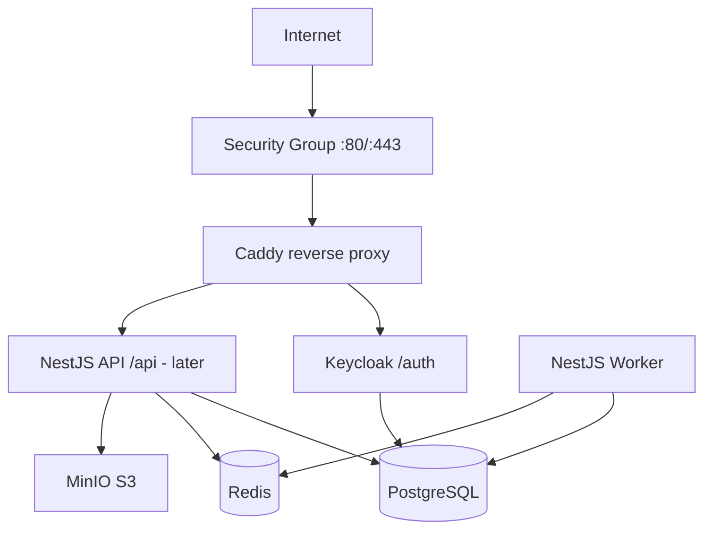

# Deployment on EC2 with Keycloak (MVP Trial)

This guide covers running the MVP infrastructure on a **single EC2 instance** using Docker Compose, with **self-hosted Keycloak** for authentication.

**Why this fits a trial EC2:**
- No Auth0/Clerk monthly cost during MVP
- Full control over realms, roles, and test users
- Same stack locally and on EC2

**Trade-off:** You operate Keycloak yourself (updates, backups, SMTP for password reset later).

**Related:**
- [infra/docker-compose.ec2.yml](../infra/docker-compose.ec2.yml)
- [infra/.env.example](../infra/.env.example)
- [Auth — Keycloak integration](./auth-keycloak.md)

---

## 1. Architecture on One EC2



| Service | Port (internal) | Public path |
|---------|-----------------|-------------|
| Caddy | 80, 443 | entry point |
| Keycloak | 8080 | `/auth` |
| API (later) | 3000 | `/api` |
| MinIO | 9000 / 9001 | internal only (MVP) |
| PostgreSQL | 5432 | internal only |
| Redis | 6379 | internal only |

---

## 2. EC2 Sizing (Trial)

| Instance | RAM | Suitability |
|----------|-----|-------------|
| `t3.small` (2 GB) | Tight | Keycloak + Postgres only for smoke test |
| `t3.medium` (4 GB) | **Recommended** | Keycloak + Postgres + Redis + MinIO + API |
| `t3.large` | Comfortable | Add worker + light traffic |

Enable **swap** (2 GB) on small instances to avoid OOM during Keycloak startup:

```bash
bash scripts/setup-swap.sh
```

**Default compose uses `start-dev`** (no heavy image rebuild). Do not use `docker-compose.ec2.prod.yml` on instances with less than ~4 GB RAM unless swap is enabled.

---

## 3. EC2 Setup Checklist

### 3.1 Launch
- AMI: **Ubuntu 24.04 LTS**
- Storage: 30+ GB gp3
- Security Group inbound:
  - `22` — your IP only (SSH)
  - `80` — `0.0.0.0/0` (HTTP trial) or your IP
  - `443` — same when TLS is enabled
- **Do not** expose Postgres, Redis, or MinIO ports publicly

### 3.2 Install Docker on EC2

```bash
sudo apt update && sudo apt upgrade -y
sudo apt install -y ca-certificates curl git
curl -fsSL https://get.docker.com | sudo sh
sudo usermod -aG docker $USER
newgrp docker
sudo apt install -y docker-compose-plugin
```

### 3.3 Clone and configure

```bash
git clone <your-repo-url> construction-platform
cd construction-platform/infra
cp .env.example .env
nano .env   # set passwords and PUBLIC_BASE_URL
```

Set `PUBLIC_BASE_URL` to:
- `http://<EC2_PUBLIC_IP>` for IP-only trial, or
- `https://app.yourdomain.com` when DNS is ready

Replace `YOUR_EC2_PUBLIC_IP` in:
- `infra/.env`
- `infra/keycloak/import/realm-construction-marketplace.json` (`redirectUris`, `webOrigins`)

### 3.4 Start stack

```bash
cd infra
bash scripts/setup-swap.sh          # strongly recommended on t3.small and smaller
docker compose -f docker-compose.ec2.yml up -d
docker compose -f docker-compose.ec2.yml ps
docker compose -f docker-compose.ec2.yml logs -f keycloak
```

First boot may take **2–4 minutes** on small instances. You should see `Running the server in development mode` — not repeated `Updating the server image` / `Killed`.

Optional (more RAM): enable MinIO with `COMPOSE_PROFILES=full docker compose -f docker-compose.ec2.yml up -d`.

### 3.5 Verify

```bash
curl http://localhost/health
# -> ok

curl -I http://localhost/auth/
# -> Keycloak response
```

Open in browser: `http://<EC2_IP>/auth/` → Keycloak admin console.

Admin login: values from `.env` (`KEYCLOAK_ADMIN` / `KEYCLOAK_ADMIN_PASSWORD`).

---

## 4. Keycloak Realm (MVP)

Realm name: **`construction-marketplace`** (imported from `infra/keycloak/import/`).

### Clients
| Client | Type | Use |
|--------|------|-----|
| `platform-web` | Public + PKCE | Next.js / browser login |
| `platform-api` | Public (resource server) | JWT validation in NestJS |

### Realm roles
`client`, `contractor`, `designer`, `admin`, `support`

Assign default role `client` to new registrations (Keycloak realm settings → Default roles).

### After import — manual steps
1. Keycloak Admin → Realm → **Clients** → `platform-web` → set valid redirect URIs for your IP/domain.
2. Enable **Email** settings when SMTP is available (password reset).
3. Create test users and assign roles for contractor/client flows.

---

## 5. When API Is Ready (NestJS)

Uncomment `api` and `worker` in `docker-compose.ec2.yml`, then:

```bash
docker compose -f docker-compose.ec2.yml up -d --build
```

Uncomment API routes in `infra/caddy/Caddyfile`.

Environment variables for API:

```env
KEYCLOAK_ISSUER=http://<PUBLIC_HOST>/auth/realms/construction-marketplace
KEYCLOAK_JWKS_URI=http://<PUBLIC_HOST>/auth/realms/construction-marketplace/protocol/openid-connect/certs
```

Use **internal** URL for JWKS fetch from container if needed:
`http://keycloak:8080/auth/realms/...` — issuer in JWT must still match what clients use (public URL).

See [auth-keycloak.md](./auth-keycloak.md).

---

## 6. TLS (Recommended Before Real Users)

**Option A — Domain + Caddy automatic HTTPS**

Point `app.example.com` A record to EC2 elastic IP, update `Caddyfile`:

```
app.example.com {
  handle /auth* {
    reverse_proxy keycloak:8080
  }
  handle /api* {
    reverse_proxy api:3000
  }
}
```

Update `PUBLIC_BASE_URL` and Keycloak client redirect URIs to `https://`.

**Option B — Cloudflare proxy** in front of EC2 (Flexible/Full SSL).

Set Keycloak `sslRequired` to `external` (already in realm export).

---

## 7. Backups (Trial Minimum)

```bash
# Postgres dump
docker compose -f docker-compose.ec2.yml exec postgres \
  pg_dump -U platform platform > backup-platform-$(date +%F).sql

# Keycloak realm export (after config changes)
# Admin Console → Realm → Action → Partial export
```

Schedule weekly dumps to S3 (same AWS account) before trial ends.

---

## 8. Cost Comparison (Auth)

| Option | MVP cost | Ops |
|--------|----------|-----|
| **Keycloak on EC2** | $0 license | You manage realm, upgrades |
| Auth0 / Clerk | Free tier limited, then per MAU | Low ops |

Keycloak on the **same EC2** as the app is the most economical choice for trial and early MVP.

---

## 9. Migration Path Later

| Stage | Change |
|-------|--------|
| Trial EC2 | Single Compose file (this guide) |
| Beta | Elastic IP + domain + TLS; separate RDS optional |
| Production | ECS Fargate + RDS + ElastiCache; Keycloak on dedicated small instance or managed IdP |

Realm export from Keycloak makes migration to another host or Auth0-compatible flows easier.

---

## 10. Troubleshooting

### Keycloak loop: `Updating the server image` → `Killed`

This is **Linux OOM** during Keycloak's production `start` build phase. Java is killed while RAM is exhausted (common on **t2.micro / t3.small** with Postgres + Redis + MinIO all running).

**Fix (in order):**

1. Pull latest `infra/docker-compose.ec2.yml` (uses `start-dev --import-realm` by default).
2. Add swap: `bash scripts/setup-swap.sh`
3. Restart clean:
   ```bash
   docker compose -f docker-compose.ec2.yml down
   docker compose -f docker-compose.ec2.yml up -d
   docker compose -f docker-compose.ec2.yml logs -f keycloak
   ```
4. Start only core services if still tight:
   ```bash
   docker compose -f docker-compose.ec2.yml up -d postgres redis keycloak caddy
   ```
5. Check memory: `free -h` — available should be > 500 MB before Keycloak starts.
6. Upsize to **t3.medium (4 GB)** for full stack + `docker-compose.ec2.prod.yml`.

**Do not use** `docker-compose.ec2.prod.yml` until the instance has enough RAM or swap.

Expected healthy log line: `Listening on: http://0.0.0.0:8080` (development mode).

| Symptom | Fix |
|---------|-----|
| Keycloak OOM / Killed | swap + `start-dev` compose; disable MinIO profile; upsize instance |
| Redirect URI mismatch | Update `platform-web` client URIs in Keycloak |
| JWT invalid issuer | `KEYCLOAK_ISSUER` must match token `iss` claim exactly |
| 502 on `/auth` | Wait 3–4 min; check `docker compose logs keycloak` |
| Postgres init failed | Remove volume only on fresh install: `docker compose down -v` (destroys data) |

---

## 11. Security Notes (Trial)

- Change all passwords in `.env` before exposing port 80 publicly
- Restrict SSH to your IP
- Do not commit `.env`
- Rotate Keycloak admin password after setup
- Remove or firewall MinIO console path unless needed
