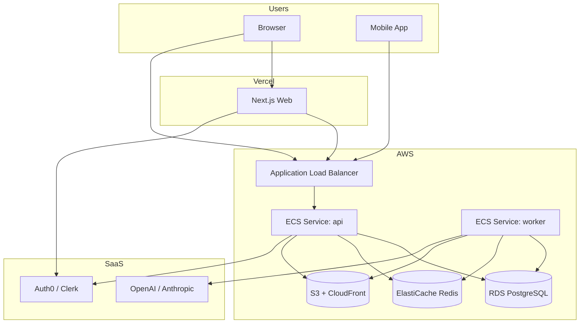
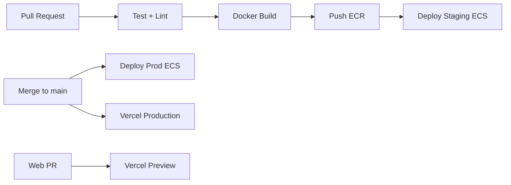

# Deployment — MVP

This document describes the recommended deployment model for the Construction Marketplace Platform MVP, including what to host on Vercel versus AWS, and when EC2 is appropriate.

**Related:** [Backend Architecture — MVP](./backend-architecture-mvp.md)

---

## 1. Short Answer

| Component | Recommended platform | Notes |
|-----------|---------------------|-------|
| **Next.js web app** | **Vercel** | Excellent fit: SSR, previews, CDN, low ops |
| **NestJS API + WebSocket** | **AWS (ECS Fargate preferred)** | Long-lived process, stable connections |
| **Background workers (BullMQ)** | **AWS (ECS Fargate or EC2)** | Must run continuously |
| **PostgreSQL** | **AWS RDS** or **Neon/Supabase** | Managed, backups, point-in-time recovery |
| **Redis** | **AWS ElastiCache** or **Upstash** | Queue, cache, WS adapter |
| **File storage** | **AWS S3** | Blueprints, photos, contracts |
| **Mobile app** | App Store / Play Store | Talks to API domain, not Vercel |

**Do not run the main backend on Vercel** for this product. Vercel is optimized for frontend and short-lived serverless functions, not a stateful NestJS monolith with workers and WebSockets.

**EC2 vs Fargate:** Prefer **ECS Fargate** for production scale. Use **a single EC2 + Docker Compose** for trial/PoC (see [Deployment on EC2 with Keycloak](./deployment-ec2-keycloak.md)).

**Auth for cost-sensitive MVP:** Self-hosted **Keycloak** on the same EC2 (see [Auth — Keycloak](./auth-keycloak.md)) instead of Auth0/Clerk until user volume grows.

---

## 2. Why Not Backend-on-Vercel?

The MVP backend requires capabilities that conflict with typical Vercel serverless limits:

| Requirement | Issue on Vercel serverless |
|-------------|---------------------------|
| BullMQ workers | Need always-on Node processes; serverless functions exit after request |
| WebSocket (tender updates, chat) | Possible with workarounds; fragile, connection limits, cold starts |
| Long AI / PDF jobs | Function timeout limits (even with extensions) |
| PostgreSQL connection pooling | Many short-lived lambdas exhaust DB connections |
| Redis-backed queues | Workers cannot live inside ephemeral function-only model |

**Acceptable Vercel usage:** Next.js frontend, optional lightweight BFF routes that proxy to the real API (usually unnecessary if API has proper CORS).

---

## 3. Recommended MVP Topology

### Domains (example)
- `app.example.com` → Vercel (Next.js)
- `api.example.com` → ALB → ECS API service
- `ws.example.com` or same host `/ws` → ALB (sticky sessions) → API WebSocket
- `cdn.example.com` → CloudFront → S3 (public/signed assets)

---

## 4. Environment Strategy

| Environment | Purpose | Infrastructure |
|-------------|---------|----------------|
| **local** | Development | Docker Compose: api, worker, postgres, redis, minio |
| **staging** | QA, demos, integration tests | AWS (smaller Fargate tasks, small RDS) |
| **production** | Live users | AWS (HA RDS, multi-AZ later, autoscaling) |

Each environment has separate: database, Redis, S3 bucket, secrets, IdP application.

---

## 5. AWS Services (MVP Checklist)

### Compute
- **ECS Fargate** — 2 services: `api` (min 2 tasks), `worker` (min 1 task)
- **ALB** — HTTP/HTTPS, health checks on `/health`, WebSocket support
- **ECR** — Docker images for api and worker

### Data
- **RDS PostgreSQL 15+** — `db.t4g.micro` or small for staging; scale for prod
- **ElastiCache Redis 7** — single node MVP; cluster mode later

### Storage & CDN
- **S3** — private bucket, presigned uploads
- **CloudFront** — optional for static downloads (contract PDFs)

### Networking & Security
- **VPC** — public subnets (ALB), private subnets (ECS, RDS, Redis)
- **ACM** — TLS certificates
- **Secrets Manager** or **SSM Parameter Store** — API keys, DB URL
- **IAM roles** — task roles for S3 access (no long-lived keys in containers)

### Observability
- **CloudWatch** — logs from ECS tasks
- Optional: Datadog / Grafana Cloud for traces and dashboards

---

## 6. EC2 vs ECS Fargate

| Criteria | ECS Fargate | EC2 (self-managed or ECS on EC2) |
|----------|-------------|-----------------------------------|
| Ops overhead | Low — no OS patching per box | Higher — AMIs, scaling groups |
| Cost at tiny scale | Slightly higher per hour | Can be cheaper with reserved instances |
| WebSocket + workers | Good fit | Good fit |
| MVP recommendation | **Preferred** | Use if team already standardized on EC2 |

**When to choose EC2:** fixed baseline traffic, GPU needs (unlikely MVP), or existing AWS EC2 automation.

---

## 7. Vercel + AWS Split (Practical Setup)

### Vercel (frontend only)
- Repository: `apps/web` or separate repo
- Environment variables:
  - `NEXT_PUBLIC_API_URL=https://api.example.com`
  - `NEXT_PUBLIC_WS_URL=wss://api.example.com`
  - IdP public client id/issuer
- Preview deployments per PR → point to **staging API**

### AWS (backend)
- Single Docker image, two commands:
  - `node dist/main.js` (API)
  - `node dist/worker.js` (Worker)
- CI: GitHub Actions → build → push ECR → deploy ECS

### CORS
API allows origins:
- `https://app.example.com`
- `https://*.vercel.app` (staging previews only — restrict in production)

---

## 8. Alternative: Lower-Ops MVP (Budget / Speed)

If AWS ECS feels heavy for the first month:

| Component | Alternative |
|-----------|-------------|
| API + Worker | **Railway**, **Render**, or **Fly.io** (always-on Web service + worker) |
| PostgreSQL | **Neon**, **Supabase**, or Railway Postgres |
| Redis | **Upstash** (serverless Redis, works with BullMQ at moderate volume) |
| Files | **S3** still recommended (portable) |
| Frontend | **Vercel** unchanged |

This is valid for **early MVP / internal beta**. Plan migration path to AWS when you need VPC isolation, compliance, or predictable scale in target markets (e.g. Thailand data residency — verify requirements separately).

---

## 9. CI/CD Pipeline (Target)

- **Backend:** GitHub Actions → ECR → ECS rolling deploy
- **Frontend:** Vercel Git integration
- **Migrations:** run Prisma migrate in CI deploy step (one job, before traffic shift)
- **Secrets:** AWS Secrets Manager; Vercel env for frontend only

---

## 10. Health Checks and Zero-Downtime

- API: `GET /health` → DB ping + Redis ping
- Worker: `GET /health` or process heartbeat metric
- ALB deregistration delay for WebSocket drains
- Database migrations: backward-compatible migrations only during rolling deploy

---

## 11. Cost Rough Order (MVP Monthly, USD)

Indicative for staging + small production (not including LLM usage):

| Item | Approx. |
|------|---------|
| Vercel Pro (team) | $20–40 |
| ECS Fargate (api 2 + worker 1, small) | $50–120 |
| RDS PostgreSQL small | $30–80 |
| ElastiCache small | $15–40 |
| S3 + transfer | $5–20 |
| **Total infra (excl. AI)** | **~$120–300/mo** |

LLM/STT/OCR costs depend on intake volume — budget separately with per-project caps.

---

## 12. Decision Summary

| Question | Answer |
|----------|--------|
| Can we use Vercel for everything? | **No** — backend and workers need always-on compute |
| Is Vercel useful? | **Yes** — for Next.js web only |
| EC2 or Fargate? | **Fargate first**; EC2 optional later |
| Minimum viable cloud | Vercel (web) + Railway/Render/Fly (api/worker) + managed PG/Redis |
| Production target | Vercel (web) + AWS ECS + RDS + ElastiCache + S3 |

---

## 13. EC2 Trial Path (Current Recommendation for PoC)

If you already have an AWS EC2 trial instance:

1. Follow [deployment-ec2-keycloak.md](./deployment-ec2-keycloak.md)
2. Use [infra/docker-compose.ec2.yml](../infra/docker-compose.ec2.yml)
3. Keep Vercel optional for frontend only; backend and Keycloak run on EC2

This avoids ECS/RDS cost during trial while matching production architecture patterns (Postgres, Redis, S3-compatible storage, OIDC).

---

## 14. Next Steps Before First Deploy

1. Register domains and TLS (ACM + Vercel).
2. Provision staging RDS + Redis + S3 bucket.
3. Deploy API and worker to staging; run smoke tests (health, WS, one AI job).
4. Connect Vercel staging preview to staging API.
5. Define backup retention and RDS snapshot policy.
6. Document secrets rotation and on-call runbook (even if informal for MVP).
