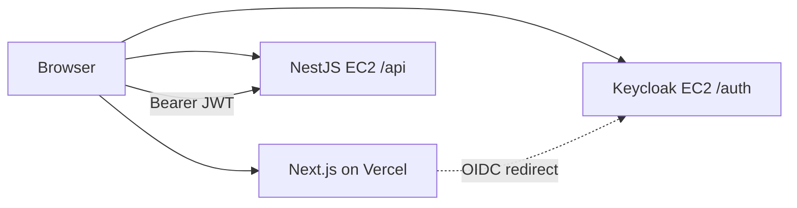

# Deploy Web App to Vercel

Minimal Next.js frontend that signs in via Keycloak and calls `GET /api/v1/me` on EC2.

**Prerequisites:** API and Keycloak running at `https://iabuilding.duckdns.org` (see [deployment-ec2-keycloak.md](./deployment-ec2-keycloak.md)).

---

## 1. Vercel project settings

| Setting | Value |
|---------|--------|
| Framework | Next.js |
| Root Directory | `apps/web` |
| Build Command | `npm run build` (default) |
| Output | default |

## 2. Environment variables

Add in Vercel → Project → Settings → Environment Variables (Production **and** Preview):

```env
NEXT_PUBLIC_KEYCLOAK_URL=https://iabuilding.duckdns.org/auth
NEXT_PUBLIC_KEYCLOAK_REALM=construction-marketplace
NEXT_PUBLIC_KEYCLOAK_CLIENT_ID=platform-web
NEXT_PUBLIC_API_URL=https://iabuilding.duckdns.org/api
```

Redeploy after changing env vars.

---

## 3. Keycloak client `platform-web`

After first deploy, copy your Vercel URL (e.g. `https://construction-platform-abc.vercel.app`).

Keycloak Admin → realm `construction-marketplace` → **Clients** → `platform-web`:

### Valid redirect URIs

```
http://localhost:3000/*
https://your-app.vercel.app/*
https://your-app-*.vercel.app/*
```

### Web origins

```
http://localhost:3000
https://your-app.vercel.app
```

Save.

---

## 4. Verify

1. Open Vercel URL in browser.
2. **Sign in with Keycloak** → login form on your domain.
3. After redirect, page shows JSON from `/v1/me`.

---

## 5. Troubleshooting

| Issue | Fix |
|-------|-----|
| Redirect URI mismatch | Add exact Vercel URL to Keycloak redirect URIs |
| CORS / blocked fetch | API uses `origin: true`; check browser network tab |
| 401 on `/v1/me` | Token issue — same as [api-smoke-test.md](./api-smoke-test.md) |
| Invalid parameter `redirect_uri` | Web origin / redirect URI must match Vercel URL exactly |
| Blank page / config error | Set all `NEXT_PUBLIC_*` on Vercel and redeploy |

---

## Architecture


