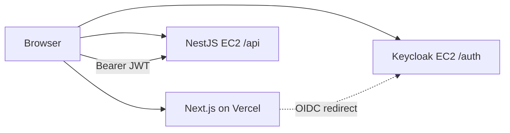

# Deploy Web App to Vercel

Minimal Next.js frontend that signs in via Keycloak and calls `GET /api/v1/me` on EC2.

**Prerequisites:** API and Keycloak running at `https://iabuilding.duckdns.org` (see [deployment-ec2-keycloak.md](./deployment-ec2-keycloak.md)).

---

## 1. Vercel project settings

| Setting | Value |
|---------|--------|
| Framework Preset | **Next.js** (not Other / Static) |
| Root Directory | `apps/web` |
| Build Command | *(leave default)* `npm run build` |
| Output Directory | **leave empty** — do NOT set `public` |
| Install Command | *(default)* `npm install` |

> **Important:** If Output Directory is set to `public`, the deploy fails with  
> `No Output Directory named "public" found`. Clear that field — Next.js uses `.next`, not `public` as build output.

The repo includes `apps/web/vercel.json` with `"framework": "nextjs"`.

## 2. Environment variables

Add in Vercel → Project → Settings → Environment Variables (Production **and** Preview):

```env
NEXT_PUBLIC_KEYCLOAK_URL=https://iabuilding.duckdns.org/auth
NEXT_PUBLIC_KEYCLOAK_REALM=construction-marketplace
NEXT_PUBLIC_KEYCLOAK_CLIENT_ID=platform-web
NEXT_PUBLIC_API_URL=https://iabuilding.duckdns.org/api
```

Redeploy after changing env vars.

---

## 3. Keycloak client `platform-web`

Modal login uses **Direct access grants** (password flow) via Next.js BFF — not browser redirect.

Keycloak Admin → realm `construction-marketplace` → **Clients** → `platform-web`:

| Setting | Value |
|---------|--------|
| Direct access grants | **ON** |
| Client authentication | Off (public) |

Redirect URIs are optional for modal login. Add Vercel URL only if you enable OIDC redirect later:

```
http://localhost:3000/*
https://ant-eta-seven.vercel.app/*
```

Save.

---

## 4. Verify

1. Open Vercel URL in browser.
2. Guest content loads without sign-in.
3. Click **Sign in** → modal → enter Keycloak user credentials.
4. Profile block appears (JSON from `/v1/me` via BFF).

---

## 5. Troubleshooting

| Issue | Fix |
|-------|-----|
| `No Output Directory named "public" found` | Vercel → Settings → Build → **clear Output Directory**; Framework = **Next.js**; Root = `apps/web` |
| Redirect URI mismatch | Only needed for OIDC redirect login; modal login uses Direct access grants |
| `Invalid username or password` | Enable **Direct access grants** on `platform-web` in Keycloak |
| CORS / blocked fetch | API uses `origin: true`; check browser network tab |
| 401 on `/v1/me` | Token issue — same as [api-smoke-test.md](./api-smoke-test.md) |
| Invalid parameter `redirect_uri` | Web origin / redirect URI must match Vercel URL exactly |
| Blank page / config error | Set all `NEXT_PUBLIC_*` on Vercel and redeploy |

---

## Architecture


