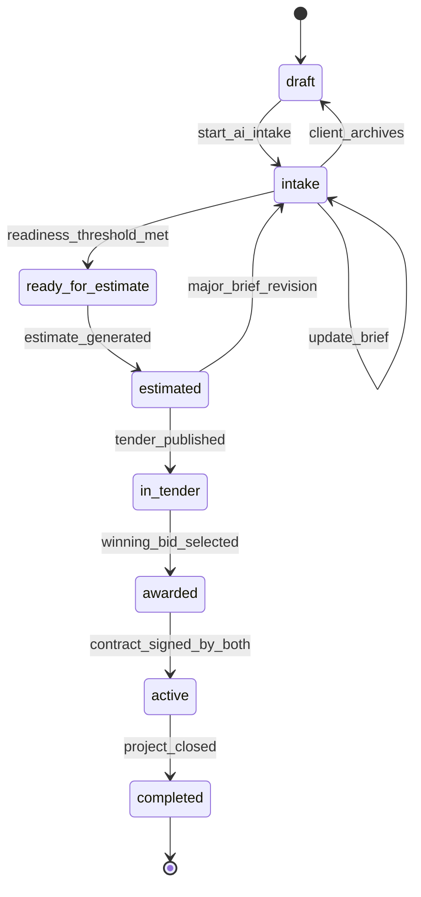
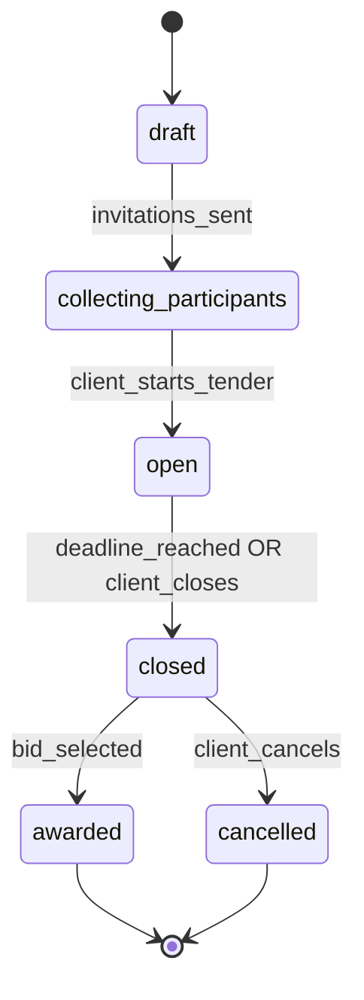
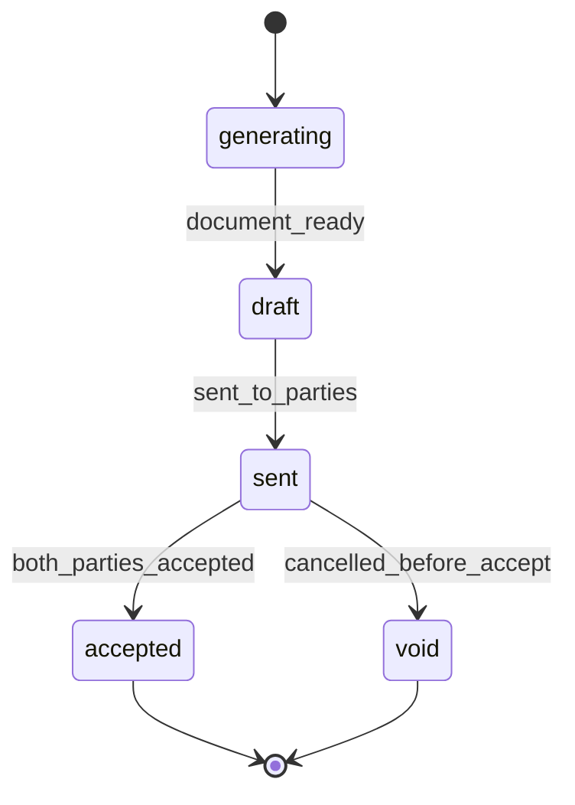

# Domain State Machines — MVP

State machines for core aggregates. All transitions must write an `audit_events` record.

---

## 1. Project

| Status | Description |
|--------|-------------|
| `draft` | Created, minimal data |
| `intake` | AI-assisted data collection in progress |
| `ready_for_estimate` | Required brief fields satisfied |
| `estimated` | At least one estimate exists |
| `in_tender` | Tender open or collecting bids |
| `awarded` | Winning bid chosen; awaiting contract signatures |
| `active` | Contract signed by both parties; work in progress |
| `completed` | Project closed, reviews enabled |

**Readiness threshold:** configurable score (e.g. 80/100) based on required `brief_json` fields and mandatory attachments.

---

## 2. Tender

| Status | Who can act |
|--------|-------------|
| `draft` | System prepares invite list |
| `collecting_participants` | Contractors accept/decline invite |
| `open` | Contractors submit bids; Q&A active |
| `closed` | No new bids; comparison phase |
| `awarded` | Linked to selected `bid_id` |
| `cancelled` | No award |

**Auto transitions:**
- `open` → `closed` when `closes_at` reached (worker job)
- Reminder notifications at T-48h, T-24h before close

---

## 3. Tender Invitation

| Status | Description |
|--------|-------------|
| `pending` | Sent, no response |
| `accepted` | Contractor will participate |
| `declined` | Contractor opted out |
| `expired` | No response before tender open |

---

## 4. Bid

| Status | Description |
|--------|-------------|
| `submitted` | Immutable after lock period (optional MVP: fully immutable) |
| `withdrawn` | Contractor withdrew before tender close |
| `selected` | Chosen as winning bid |
| `rejected` | Not selected after award |

**Rule:** One `selected` bid per tender. Selecting a bid triggers project → `awarded` and creates a contract record awaiting signatures.

---

## 5. Contract

MVP acceptance: click-to-accept on platform (no e-signature provider).

**Platform fees (client-paid, trial disclosure):** Before the client selects a winning bid and again before the client signs, the UI shows the listed **platform access fee** (USD 100, credited toward success fee) and **success fee** (2% − credit). During trial the payable amount is **0** (100% discount). Contractors see an informational note only. No payment capture in MVP.

---

## 6. Contractor Verification

| Status | Description |
|--------|-------------|
| `pending` | Registered, not verified |
| `verified` | Admin approved; eligible for auto-invite |
| `suspended` | Cannot receive new tenders |
| `rejected` | Application denied |

Only `verified` contractors enter automated tender distribution.

---

## 7. Support Ticket

| Status | Description |
|--------|-------------|
| `open` | Created |
| `in_progress` | Support assigned |
| `resolved` | Answer provided |
| `closed` | Confirmed by user or auto-close |

**Policy:** Tickets tagged `construction_advice` are auto-replied with scope disclaimer and not escalated to technical staff.

---

## 8. Authorization Matrix (Simplified)

| Action | Client | Contractor | Admin |
|--------|--------|------------|-------|
| Update brief | own project | — | — |
| Publish tender | own project | — | yes |
| Submit bid | — | invited + open tender | — |
| Select bid | own project | — | yes |
| Accept contract | own project | winning contractor | — |
| Verify contractor | — | — | yes |
| Post progress update | — | assigned project | — |

---

## 9. Domain Events (for Outbox)

| Event | Triggers |
|-------|----------|
| `project.ready_for_estimate` | Estimation job |
| `estimate.completed` | Notification to client |
| `tender.published` | Invitation emails |
| `tender.question.created` | Notify client |
| `bid.submitted` | Notify client; WS broadcast |
| `bid.selected` | Contract generation job |
| `contract.accepted` | Project → active; notify parties |
| `project.completed` | Review request notification |
