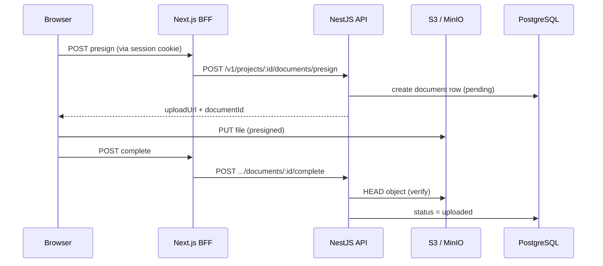

# Storage — S3 setup

Project documents (blueprints, photos, specs) upload via **presigned URLs**: the browser sends the file directly to object storage; the API only issues short-lived URLs and stores metadata in Postgres.

**Related:** [Backend Architecture — MVP](./backend-architecture-mvp.md) (media module), [Deployment — EC2](./deployment-ec2-keycloak.md)

---

## Architecture



---

## Environment variables

| Variable | Required | Description |
|----------|----------|-------------|
| `S3_BUCKET` | yes | Bucket name, e.g. `platform-uploads` |
| `S3_ACCESS_KEY_ID` | yes | IAM / MinIO access key |
| `S3_SECRET_ACCESS_KEY` | yes | Secret key |
| `S3_REGION` | yes | e.g. `us-east-1` (MinIO: any value) |
| `S3_ENDPOINT` | MinIO only | Internal URL for API, e.g. `http://minio:9000` |
| `S3_PUBLIC_ENDPOINT` | MinIO only | Public URL used in presigned links, e.g. `https://your-domain/storage` |
| `S3_FORCE_PATH_STYLE` | MinIO | `true` (default in compose) |
| `S3_UPLOAD_URL_TTL_SECONDS` | no | Default `900` (15 min) |
| `S3_DOWNLOAD_URL_TTL_SECONDS` | no | Default `300` (5 min) |

If `S3_BUCKET` or credentials are missing, upload endpoints return **503 Service Unavailable**.

---

## Option A — MinIO on EC2 (MVP / trial)

MinIO is S3-compatible and runs in the same Docker Compose stack.

### 1. Enable MinIO profile

In `infra/.env`:

```env
COMPOSE_PROFILES=full

MINIO_ROOT_USER=minioadmin
MINIO_ROOT_PASSWORD=your_strong_minio_password

S3_BUCKET=platform-uploads
S3_REGION=us-east-1
S3_ENDPOINT=http://minio:9000
S3_PUBLIC_ENDPOINT=https://iabuilding.duckdns.org/storage
S3_ACCESS_KEY_ID=minioadmin
S3_SECRET_ACCESS_KEY=your_strong_minio_password
S3_FORCE_PATH_STYLE=true
```

MinIO needs ~256 MB RAM. Use **t3.medium** or enable swap on smaller instances.

### 2. Start services

```bash
cd ~/construction-platform/infra
docker compose -f docker-compose.ec2.yml --profile full up -d minio minio-init
docker compose -f docker-compose.ec2.yml up -d --build api
docker compose -f docker-compose.ec2.yml restart caddy
```

`minio-init` creates the bucket on first run.

### 3. Caddy proxy

Caddy exposes MinIO S3 API at `/storage` (see `infra/caddy/Caddyfile`). Browsers must reach this URL for presigned uploads — the internal `minio:9000` hostname is not public.

### 4. Verify

```bash
# API health
curl -s https://iabuilding.duckdns.org/api/health

# MinIO (from EC2 host)
docker compose -f docker-compose.ec2.yml exec minio mc alias set local http://localhost:9000 $MINIO_ROOT_USER $MINIO_ROOT_PASSWORD
docker compose -f docker-compose.ec2.yml exec minio mc ls local/platform-uploads
```

Upload a file from the project detail page in the web app.

### MinIO console (optional)

Admin UI at `https://your-domain/minio-console` — restrict by Security Group / IP in production.

---

## Option B — AWS S3 (staging / production)

Use real S3 when moving off a single EC2 box.

### 1. Create bucket

```bash
aws s3 mb s3://your-app-uploads-staging --region eu-central-1
```

Recommended settings:
- **Block all public access** — enabled
- **Encryption** — SSE-S3 or SSE-KMS
- **Versioning** — optional for contracts

### 2. IAM policy (API task role)

```json
{
  "Version": "2012-10-17",
  "Statement": [
    {
      "Effect": "Allow",
      "Action": ["s3:PutObject", "s3:GetObject", "s3:DeleteObject", "s3:HeadObject"],
      "Resource": "arn:aws:s3:::your-app-uploads-staging/*"
    },
    {
      "Effect": "Allow",
      "Action": "s3:ListBucket",
      "Resource": "arn:aws:s3:::your-app-uploads-staging"
    }
  ]
}
```

Attach to ECS task role (preferred) or create an IAM user with access keys for EC2 MVP.

### 3. API environment

```env
S3_BUCKET=your-app-uploads-staging
S3_REGION=eu-central-1
S3_ACCESS_KEY_ID=...
S3_SECRET_ACCESS_KEY=...
# Leave S3_ENDPOINT and S3_PUBLIC_ENDPOINT empty — AWS default endpoints are used
S3_FORCE_PATH_STYLE=false
```

Presigned URLs will point to `https://your-app-uploads-staging.s3.eu-central-1.amazonaws.com/...`.

### 4. CORS on bucket

Browsers upload via PUT to presigned URLs. Add CORS rules:

```json
[
  {
    "AllowedHeaders": ["*"],
    "AllowedMethods": ["PUT", "GET", "HEAD"],
    "AllowedOrigins": [
      "https://ant-eta-seven.vercel.app",
      "https://app.example.com"
    ],
    "ExposeHeaders": ["ETag"],
    "MaxAgeSeconds": 3000
  }
]
```

Apply via AWS Console → Bucket → Permissions → CORS, or:

```bash
aws s3api put-bucket-cors --bucket your-app-uploads-staging --cors-configuration file://cors.json
```

---

## API endpoints

| Method | Path | Description |
|--------|------|-------------|
| GET | `/v1/projects/:projectId/documents` | List uploaded documents |
| POST | `/v1/projects/:projectId/documents/presign` | Get presigned upload URL |
| POST | `/v1/projects/:projectId/documents/:documentId/complete` | Confirm upload after PUT |
| GET | `/v1/projects/:projectId/documents/:documentId/download-url` | Presigned download URL |

### Presign request body

```json
{
  "fileName": "kitchen-plan.pdf",
  "contentType": "application/pdf",
  "sizeBytes": 1048576,
  "category": "blueprint"
}
```

Categories: `blueprint`, `photo`, `specification`, `estimate`, `contract`, `other`.

Max file size: **25 MB** (MVP).

---

## Object key layout

```
projects/{projectId}/documents/{documentId}/{sanitized-filename}
```

Metadata lives in Postgres `documents` table; S3 holds bytes only.

---

## Troubleshooting

| Symptom | Likely cause |
|---------|----------------|
| 503 on presign | S3 env vars not set on API container |
| Upload PUT fails (CORS) | Missing bucket CORS (AWS) or wrong `S3_PUBLIC_ENDPOINT` (MinIO) |
| Complete fails “object not found” | PUT never reached S3, or wrong bucket/key |
| Presigned URL host unreachable | `S3_PUBLIC_ENDPOINT` must match public URL (MinIO via Caddy) |

Check API logs:

```bash
docker compose -f docker-compose.ec2.yml logs api --tail=50
```

---

## Local development

Run MinIO locally or point to a dev S3 bucket. Example `.env` for API:

```env
S3_BUCKET=platform-uploads
S3_REGION=us-east-1
S3_ENDPOINT=http://localhost:9000
S3_PUBLIC_ENDPOINT=http://localhost:9000
S3_ACCESS_KEY_ID=minioadmin
S3_SECRET_ACCESS_KEY=minioadmin
S3_FORCE_PATH_STYLE=true
```

Start MinIO with Docker:

```bash
docker run -p 9000:9000 -p 9001:9001 minio/minio server /data --console-address ":9001"
```

Create bucket via MinIO console at http://localhost:9001.
